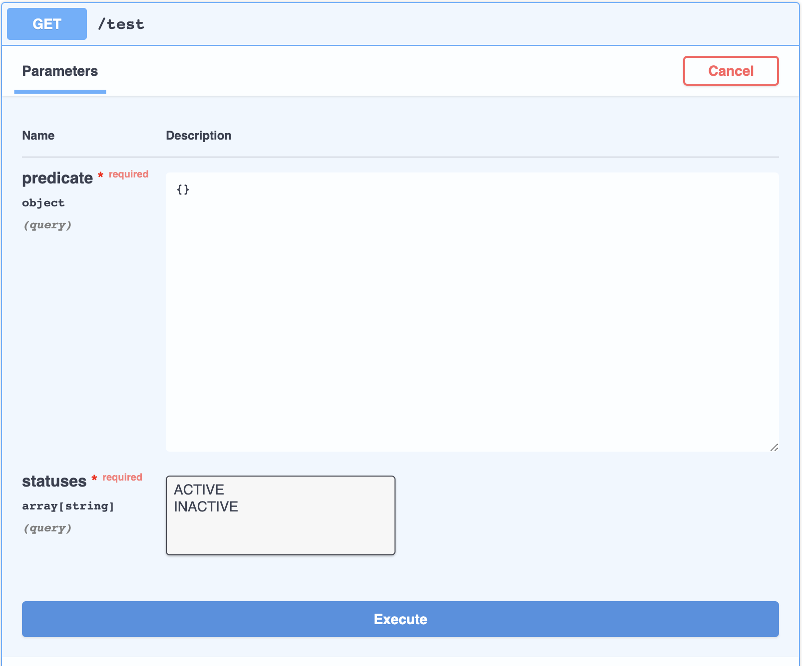
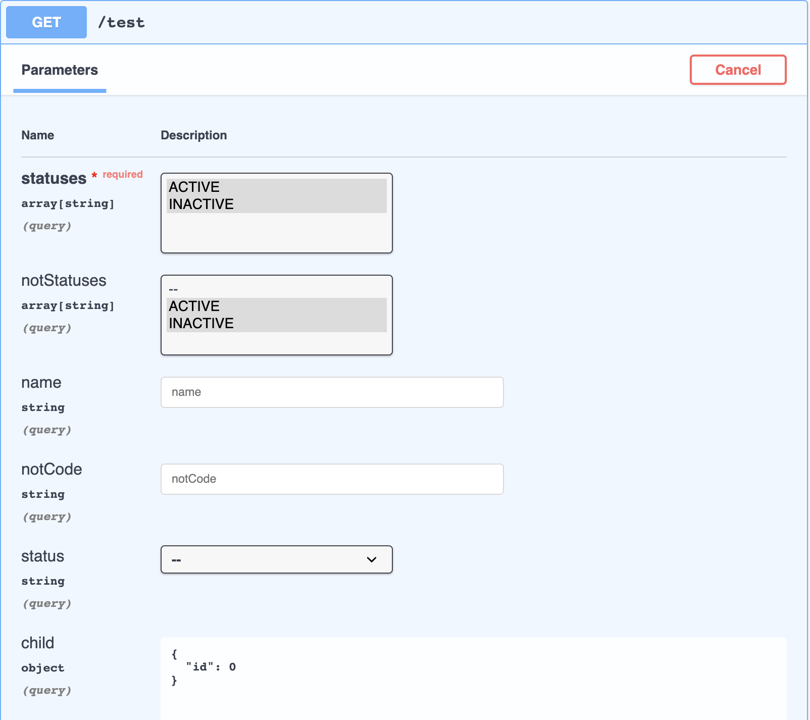
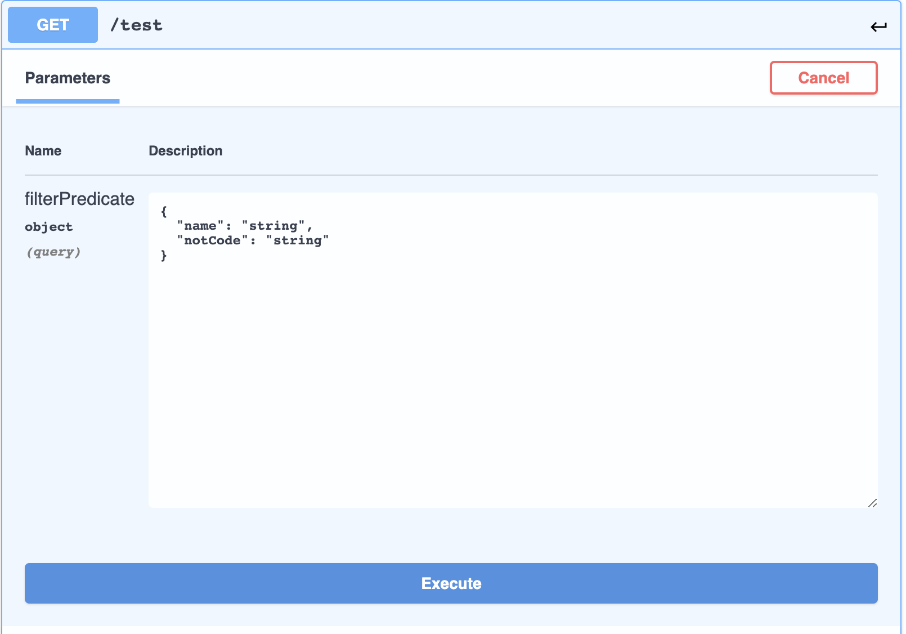

[](https://jitpack.io/#gibahjoe/springdoc-param-customizer)

# Introduction

This is a simple library that is an extension of the [Springdoc-Openapi library](https://springdoc.org/)

This library adds support of the [QueryDsl](http://www.querydsl.com/) _@QuerydslPredicate_ annotation to [Springdoc-Openapi library](https://springdoc.org/)

It is also very customizable and supports any annotation (ships with @QuerydslPredicate annotation support but more coming later).

###### Before



###### After Method 1



###### After Method 2




## Installation

Add to your build.gradle

```groovy
allprojects {
    repositories {
	    maven { url 'https://jitpack.io' }
	}
}
```

```groovy
dependencies {
    implementation 'com.github.gibahjoe:springdoc-param-customizer:[version]'
}
```

## Usage

There are 2 ways to use this library. Both involve creating a bean in your spring project.

###### METHOD 1

Registering QuerydslPredicateOperationCustomizer.java as a bean (see below)

```java
@Configuration
public class WebConfiguration implements WebMvcConfigurer {
    //some config
    
    
@Bean
public QuerydslPredicateOperationCustomizer querydslPredicateOperationCustomizer(QuerydslBindingsFactory querydslBindingsFactory) {
   return new QuerydslPredicateOperationCustomizer(querydslBindingsFactory);
}

    //other config    
}
```

###### METHOD 2

Using AnnotatedParameterCustomizer.java (a bean that helps to intercept any annotated spring method param for you to customise) and adding the inbuilt DefaultQuerydslPredicateCustomizer. See example below using querydsl customizer

```java

import com.devappliance.springdocparamcustomizer.AnnotatedParameterCustomizer;
import com.devappliance.springdocparamcustomizer.customizerImpl.DefaultQuerydslPredicateCustomizer;

@Configuration
public class WebConfiguration implements WebMvcConfigurer {
    //some config
    
    @Bean
   public AnnotatedParameterCustomizer annotatedParameterCustomizer(Optional<OpenAPI> openAPI, ObjectProvider<EntityPathResolver> resolver) {
       return new AnnotatedParameterCustomizer(openAPI)
                   .addCustomizer(new DefaultQuerydslPredicateCustomizer(new QuerydslBindingsFactory(resolver.getIfAvailable(() -> SimpleEntityPathResolver.INSTANCE))));
   }

    //Ensure to include a bean of your openapi too in your config
    @Bean
    public OpenAPI openApi() {
        return new OpenAPI();
    }

    //other config    
}

```

The above example uses the inbuilt _DefaultQuerydslPredicateCustomizer_ which displays QueryDslPredicate parameters properly in OpenApi document

## Features and bugs

Please file feature requests and bugs at the [issue tracker][tracker].

[tracker]: https://github.com/gibahjoe/springdoc-param-customizer/issues
